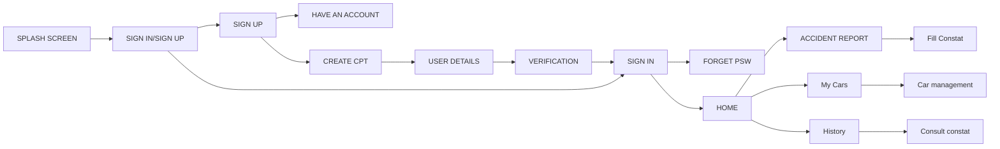

# eConstat_BackEnd
# Welcome To eConstat!

# Technologies
this project is made with :
- Node js version 9.1.1
- vsCode
- MongoDB

### Figma : 
https://www.figma.com/file/YaMjf82vZN1oVX2XgPTdRA/IOS-Project-E-constat?node-id=0%3A1&t=1YDXNTHmXTN0DiMR-0

## NodeJs

Node.js est une plateforme logicielle libre en JavaScript, orientée vers les applications réseau évènementielles hautement concurrentes qui doivent pouvoir monter en charge.

### Installez les dépendances et exécutez le serveur :
#### Exécutez le serveur 
			$ npm install
			$ npm run start
####  Installez les dépendances :
		$ npm install bcrypt 

 - Bcrypt npm : la fonction de hachage de mot de passe bcrypt.

	   $ npm install cors

 - CORS : package for providing a Connect/Express middleware.

		 $ npm install email-validator

 -Email-validator : Validation une adresse e-mail

	$ npm install express

 - Express un Framework qui nous permettra de faciliter la création de services web.

	     $ npm install jsonwebtoken
 - Jsonwebtoken : utiliser pour l'authentification ,Lorsqu'un utilisateur se connecte à une application, celle-ci lui attribue un JWT.
 - JWTs can be signed using a secret or a public/private key pair.

		$ npm install mongoose
 - Mongoose est une bibliothèque ODM (Object Data Modeling) basée sur Node.js pour MongoDB.

		$ npm install morgan
 - Morgan est un middleware Node.js et Express pour enregistrer les requêtes et les erreurs HTTP.

		$ npm install multer

 - Multer est un paquet npm qui permet de gérer facilement les téléchargements de fichiers.

		$ npm install nodemailer

 - Nodemailer :  designed for sending emails.

##Besoins fonctionnels

## Architecture MVC

****